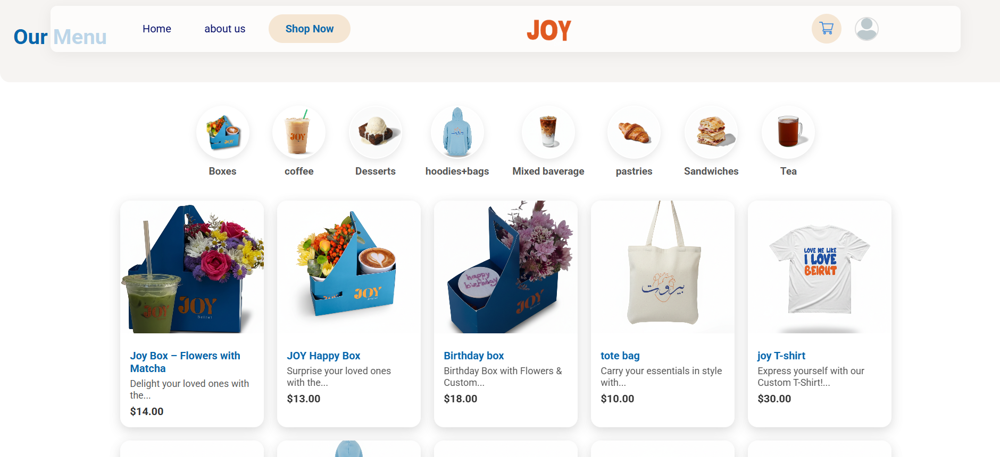
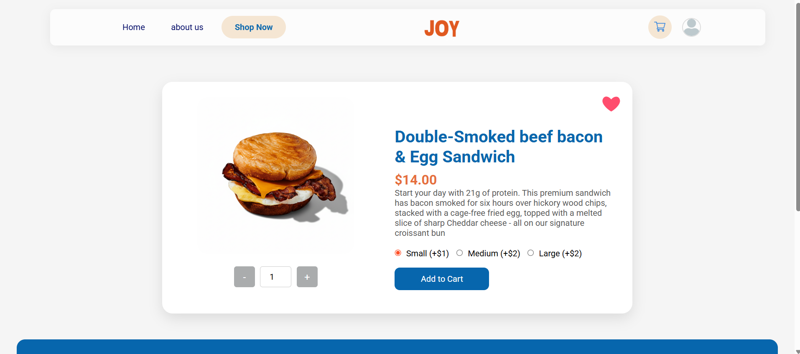
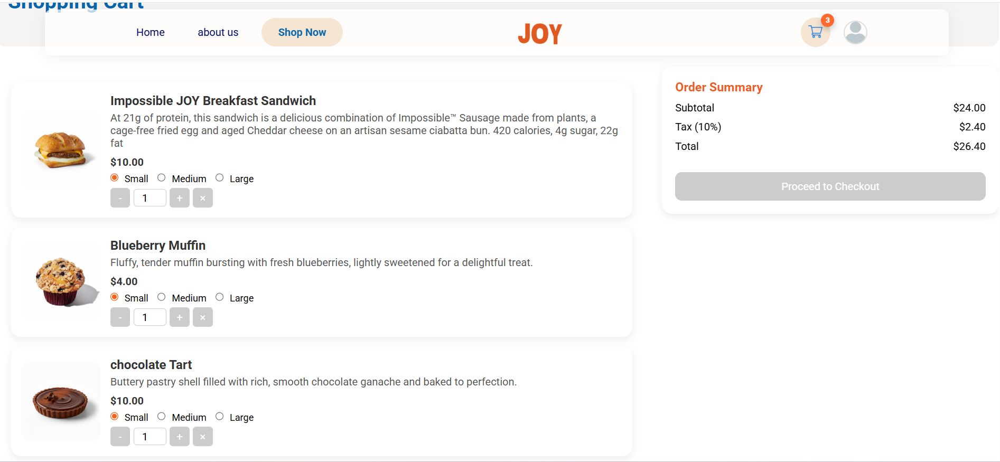
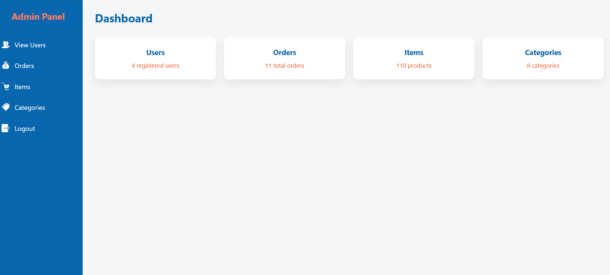
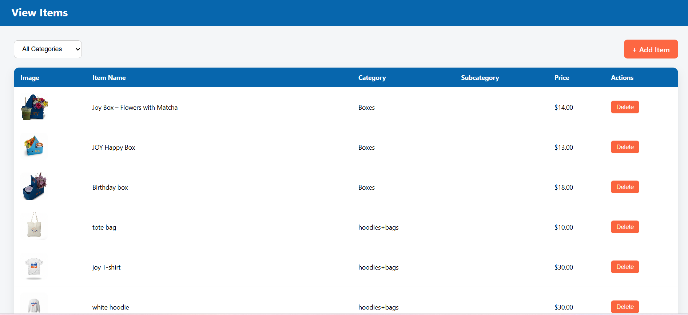
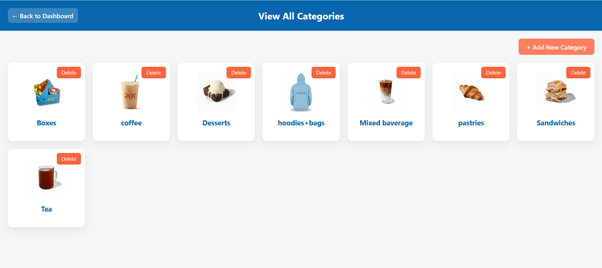

# Joy Coffee E-Commerce Website

Joy Coffee is a full-stack e-commerce website developed for a coffee shop. The project combines a customer-facing shopping experience with an administrative dashboard for managing products, categories, and orders.

## Features

### Customer Features

- Responsive and animated home page
- Product browsing and categories
- Product detail pages
- Add-to-cart functionality
- Shopping cart management
- Customer account page
- Login page
- Order-related functionality
- Interactive JavaScript features

### Admin Features

- Admin dashboard
- Product and item management
- Category management
- Order management
- Store content management
- Dedicated administration pages

## Technologies

- HTML5
- CSS3
- JavaScript
- PHP
- MySQL
- XAMPP
- Apache
- phpMyAdmin
- Git and GitHub

## Project Structure

The screenshots are stored directly in the project root directory:

```text
JoyCoffee/
├── accountPage.png
├── Admin.png
├── categoriesAdmin.png
├── footer.png
├── HomePage.png
├── itemDetail.png
├── itemsPage.png
├── LoadingPage.png
├── LoginPage.png
├── myCart.png
├── OrdersAdmin.png
├── ShopingPage.png
└── README.md
```

## Screenshots

### Home Page


### Shopping Page



### Product Details



### Shopping Cart



### Login Page


### Account Page


### Loading Page


## Admin Dashboard

### Admin Dashboard



### Products Management



### Categories Management



### Orders Management


### Footer


## Database

The application uses MySQL to manage the e-commerce data.

The database name must match the database name configured in the PHP connection file.

Example:

```php
$servername = "localhost";
$username = "root";
$password = "";
$dbname = "YOUR_DATABASE_NAME";
```

Replace `YOUR_DATABASE_NAME` with the database name used by your project.

If you change the database name, update the PHP database connection accordingly.

## How to Run Locally

### 1. Install XAMPP

Install XAMPP with Apache and MySQL.

### 2. Start Apache and MySQL

Open the XAMPP Control Panel and start:

- Apache
- MySQL

### 3. Place the Project in `htdocs`

Copy the complete `JoyCoffee` project folder into the XAMPP `htdocs` directory.

Example:

```text
C:\xampp\htdocs\JoyCoffee
```

### 4. Configure the Database

Open phpMyAdmin:

```text
http://localhost/phpmyadmin
```

Create the MySQL database using the same name configured in the PHP connection file.

If the project includes an SQL database file, import it into the newly created database.

### 5. Check the PHP Database Connection

Open the PHP connection file and verify the database configuration.

For a standard local XAMPP setup:

```php
$servername = "localhost";
$username = "root";
$password = "";
$dbname = "YOUR_DATABASE_NAME";
```

Make sure the database name matches the database created in phpMyAdmin.

### 6. Run the Website

Open the following URL in your browser:

```text
http://localhost/JoyCoffee/
```

## Project Highlights

- Full-stack e-commerce application
- PHP backend and MySQL database integration
- Interactive JavaScript functionality
- Product browsing and product details
- Add-to-cart functionality
- Customer account functionality
- Admin dashboard
- Product management
- Category management
- Order management
- Responsive and animated user interface
- Local development using XAMPP and Apache

## Purpose

Joy Coffee was developed as a full-stack e-commerce project to demonstrate practical experience in frontend development, backend development, database integration, interactive web functionality, and administrative systems.

## Author

Iman Soleiman

Computer Engineering Graduate

GitHub: https://github.com/imanSoleiman
